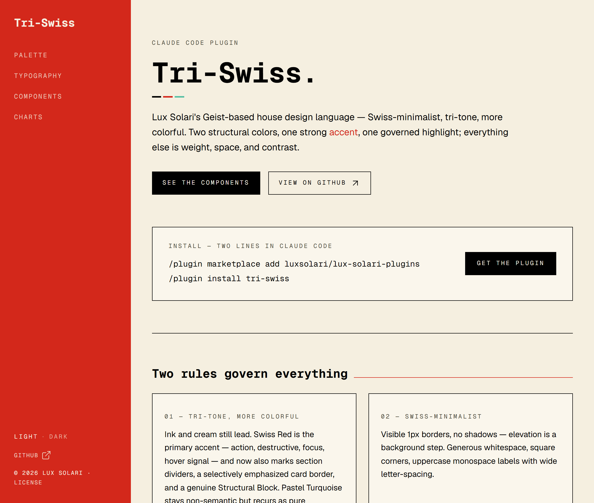
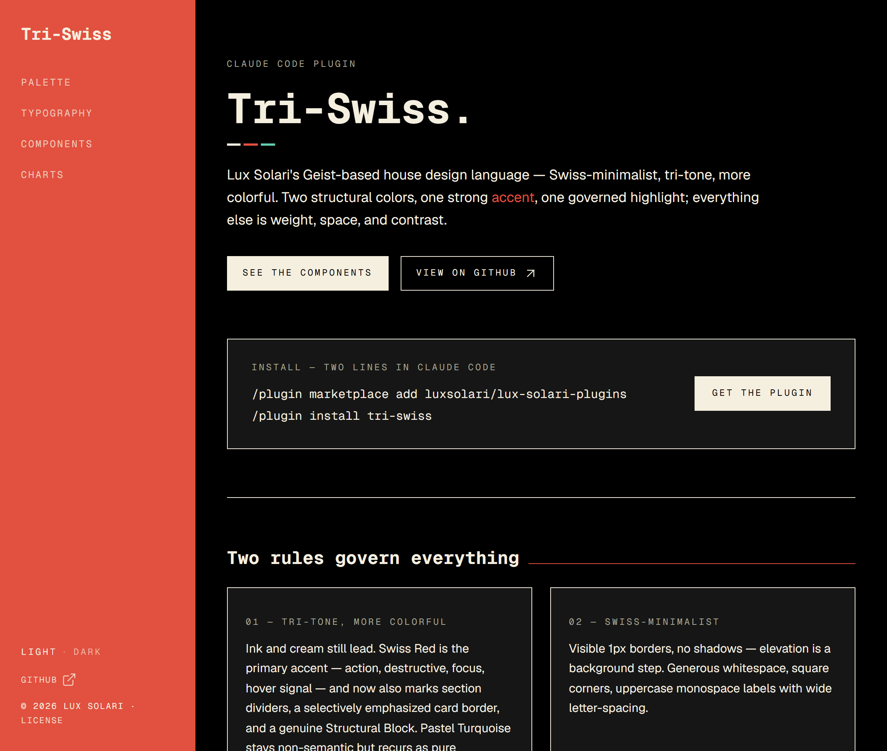
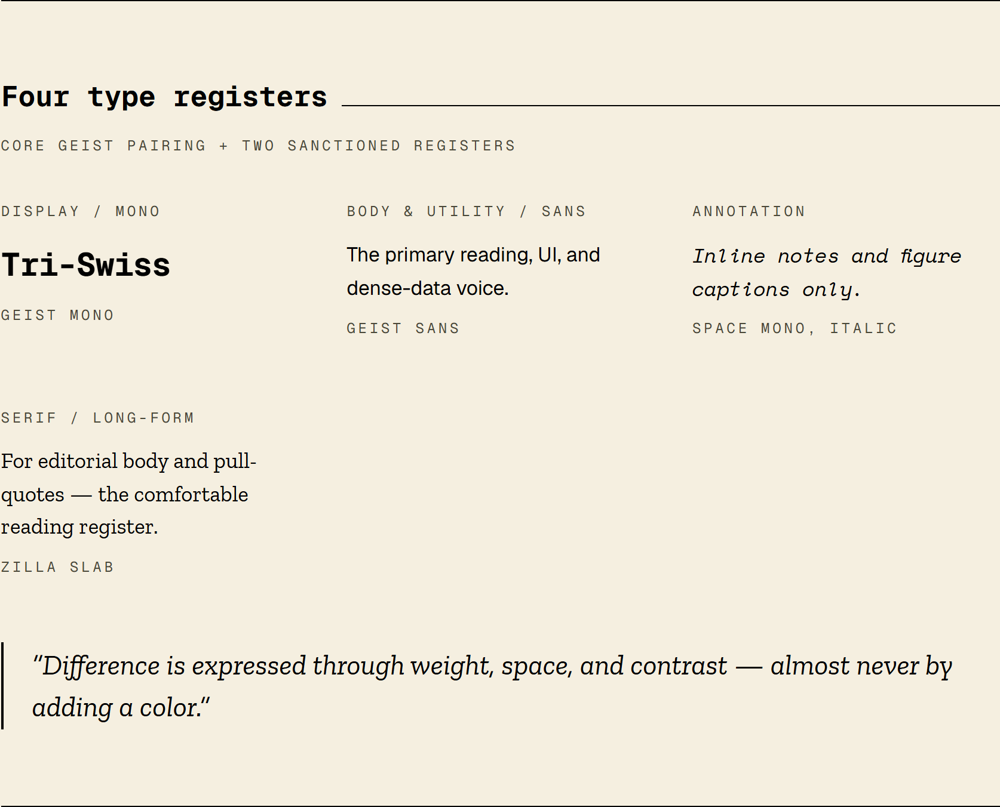
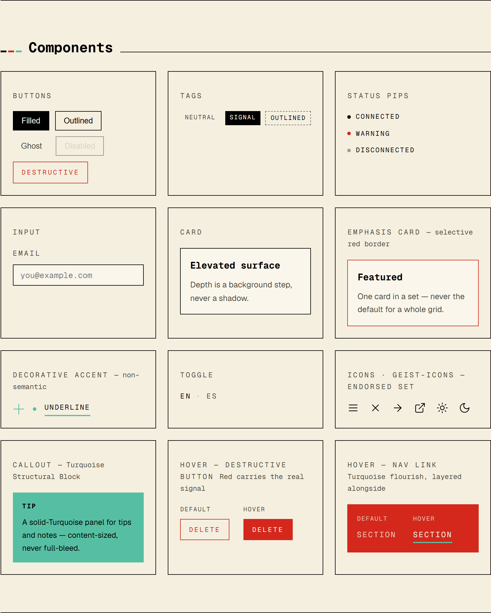
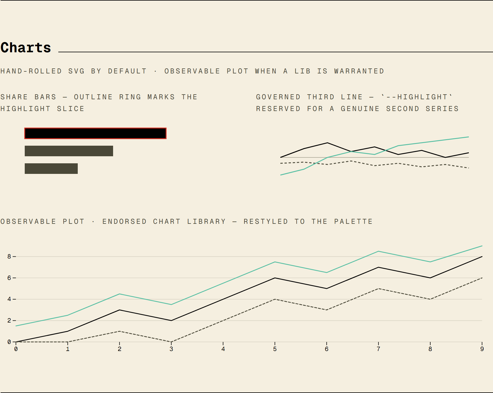
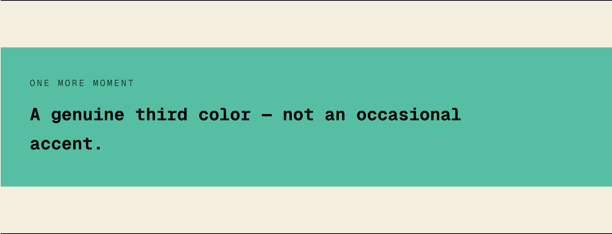
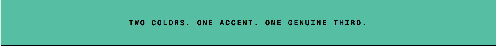

# Tri-Swiss

[](https://github.com/luxsolari/tri-swiss/releases)
[](LICENSE)
[](LICENSE-DESIGN)

<p align="center">
  <a href="https://luxsolari.github.io/tri-swiss/">
    
  </a>
</p>

<p align="center"><strong><a href="https://luxsolari.github.io/tri-swiss/">View the live demo →</a></strong></p>

A Claude Code plugin that teaches Claude **Tri-Swiss** — Lux Solari's
Geist-based house design language, sibling to
[Lux Swiss](https://github.com/luxsolari/lux-swiss) (formerly Duotone
Swiss) — so every project you build shares one consistent, opinionated
aesthetic.

Tri-Swiss and Lux Swiss are the two house-mark design systems that carry
Lux Solari's personal brand identity into every project built with them —
related governance, distinct palettes. See [HOUSE-MARK.md](HOUSE-MARK.md)
for how the two relate.

## The aesthetic

**Tri-tone, more colorful, still Swiss-minimalist.** Two structural colors
— ink (`#000000`) and warm cream (`#f5efe0`) — plus a Swiss Red accent
(`#d3281b`) that now also marks section dividers, selective card emphasis,
a genuine Structural Block (a solid-color sidebar/hero band, capped at
~25% of viewport, or a bold word inside a heading), and hover-state
feedback wherever an accent signals interactivity, and a non-semantic
highlight, Pastel Turquoise (`#56bfa3`), used decoratively across icon
fills, underlines, washes, chart series, a hover-triggered flourish on
nav links, and now its own smaller Structural Block (a callout panel, a
second-moment panel, a closing band). The tri-part segment stripe — the
one place all three colors meet — is reusable at any length as a
decorative divider, not a one-off. No success green, no info blue, no
second *semantic* accent — the highlight never carries meaning, however
often it recurs.

- Visible 1px borders everywhere; **no shadows** (elevation is a background step).
- Generous whitespace; mostly square corners.
- **Geist Mono** for headings, data, tags, and nav; **Geist Sans** for body
  and dense-data/utility text.
- One governed extra register: **Space Mono** (italic, annotations/captions
  only — the visible nod to Lux Swiss, formerly Duotone Swiss).
- Uppercase monospace labels with wide letter-spacing.
- Hand-rolled SVG charts by default — no chart libraries except a
  restyled Observable Plot.

## See it

Light and dark are the same tri-tone system inverted — difference by
contrast, never by a new hue:

| Light | Dark |
|-------|------|
|  |  |

Four type registers and the component library:





Turquoise's own Structural Block — a genuine third color, not an occasional accent:




## What it does

Once installed, the `tri-swiss` skill activates automatically whenever
Claude builds or restyles UI — components, pages, forms, dashboards,
Tailwind/CSS themes — and applies these tokens and patterns by default,
even if you don't name the design system. You can also invoke it explicitly
("apply my design system", "make this tri-swiss", "use the Geist system").

The skill bundles:

- **`assets/theme.css`** — ready-to-paste Tailwind 4 theme with every token
  for light + dark mode. Drop it into `app/globals.css` (or any global
  stylesheet).
- **`references/components.md`** — the full component catalogue: buttons,
  tags, status pips, modals, toggles, cards, inputs, hero/annotation type
  patterns, and the SVG chart patterns.

## Install

Add the marketplace, then install:

```
/plugin marketplace add luxsolari/lux-solari-plugins
/plugin install tri-swiss
```

## Applying it to a project

1. Copy `assets/theme.css` into your global stylesheet.
2. Add the Geist + Geist Mono + Space Mono + Zilla Slab Google Fonts
   link (or `next/font`).
3. Build with the semantic tokens (`bg-background`, `text-foreground`,
   `border-border`, `bg-primary`, …) and the component patterns. Reach for
   `bg-highlight`/`text-highlight` decoratively — icon fills, underlines,
   washes, a chart's second series, a brand moment, a callout/panel/
   closing-band background (paired with `text-highlight-foreground`) —
   never for a button, tag, or status color, and never to signal state on
   its own in a hover.

Dark mode is the `.dark` class on `<html>`, toggled via JS and persisted to
`localStorage` under a `theme` key.

## License

This repository is dual-licensed:

- **The design system itself** (`skills/tri-swiss/`, `docs/index.html`,
  `docs/assets/`, [HOUSE-MARK.md](HOUSE-MARK.md)) — CC BY-SA 4.0 © 2026
  Lux Solari (Luciano Laje). Free to use and adapt, including
  commercially, provided you credit Lux Solari and license your
  derivative under the same terms. See [LICENSE-DESIGN](LICENSE-DESIGN).
- **Everything else** (build/tooling scripts, CI config, git hooks, and
  project documentation such as this README) — MIT/X11 © 2026 Lux
  Solari (Luciano Laje). See [LICENSE](LICENSE).
